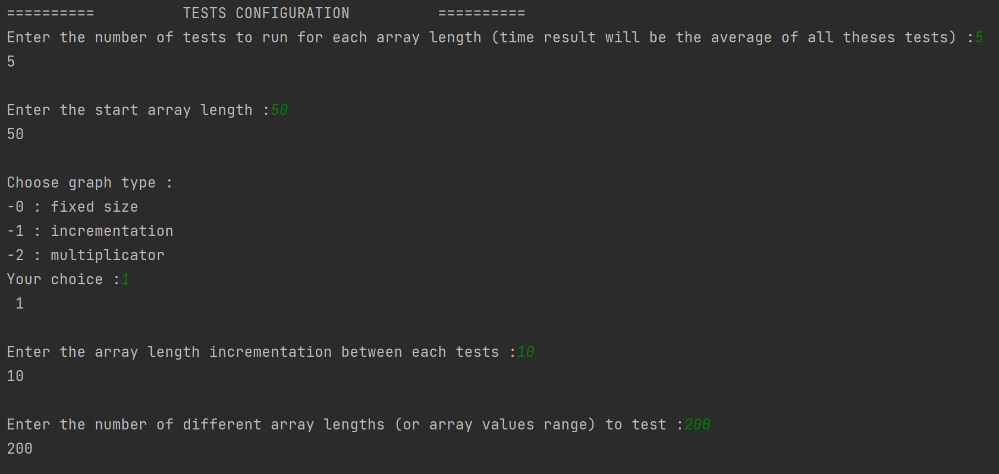
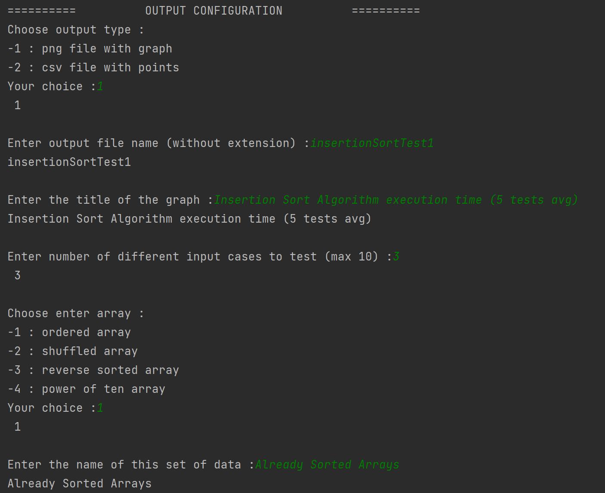
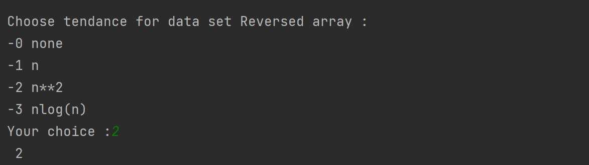
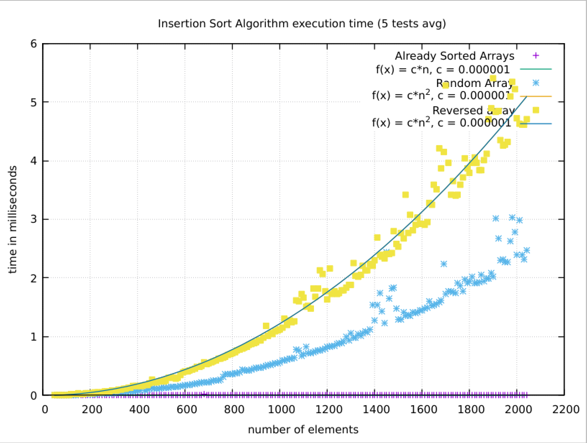

# Code & PDF submission for a group project, start of year 2, ISEN Nantes

## This project was carried out with Mathias Paitier, Raphaël Fosse & [Vincent Rocher](https://github.com/stonelec)

The main goal was to analyze some sorting algorithms and write a report in english, the code was not evaluated

## The programm we used :

The programm we used can be found in this repo under algorithms.c and algorithms.h files.

It is capable of 

- Generate arrays of numbers
- Test different sorting algorithms
- Plot a graph with gnuplot

### Arrays

Different variables can be modified to test a sorting algorithm :
- Array size can be fixed, incremented, multiplicated
- Array element range can be fixed or of different (power of ten) values
- Array elements can be already sorted, in a random order, reversed

### Tests

Only one sorting algorithm can be tested at a time
- Number of tests of different array size can be chose
- Number of tests for one fixed n size can be chose (execution time will be the average of theses tests)
- Number of different cases of input array can be chose (cases stand for sorted reversed or random enters)

### Plotting

All cases will be of a different color/style
- User can select point or lines for tests output on graph
- User can add a trend for each case (n, n² or nlogn)

## Preview

